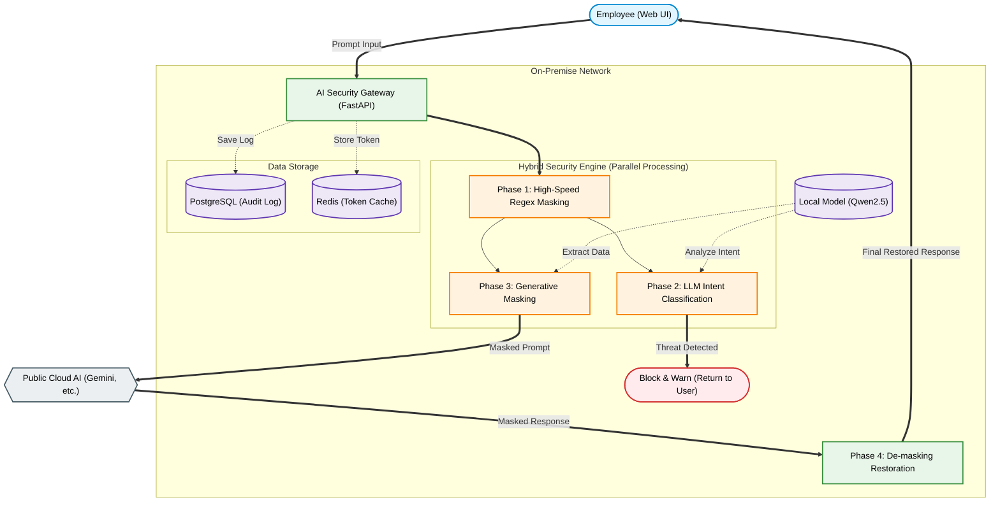

# AutoCore AI Security Gateway System Architecture

This document details the system architecture of the **Local LLM-Based Hybrid AI Security Gateway** and the core technologies powering its 3-phase security pipeline.

---

## 1. System Overview

The AutoCore Gateway is deployed independently within the corporate on-premise network, acting as a **Security Proxy** between employees (clients) and external commercial LLMs.

---

## 2. The 3-Phase Hybrid Pipeline in Detail

To overcome the limitations of single-technology security solutions (e.g., Regex's inability to understand context, or the paradox of total blocking), we designed a **Defense-in-Depth** architecture.

### Phase 1: High-Speed Regex Filter (Pattern Filter)
This is the fastest and most deterministic first line of defense, functioning like an airport metal detector.
* **Mechanism:** Uses Regular Expressions (Regex) to detect structured confidential data with clear patterns, such as Employee IDs, phone numbers, and standardized blueprint numbers.
* **Pre-blocking:** Filters out known prompt injection keywords (e.g., `"ignore previous instructions"`, `"config.json"`, `sudo`) to reduce the processing load on the local LLM backend.
* **Token Format Design:** Substitutes data with unique tokens in the `__MASK_{TYPE}_{8-hex-chars}__` format.
  * *Design Rationale:* Combining special symbols with random hex codes prevents external LLMs from arbitrarily breaking down the token (Tokenization), forcing them to treat it as a proper noun.

### Phase 2: LLM Intent Classification (LLM-as-a-Judge)
The second line of defense that blocks sophisticated attacks missed by Regex.
* **Mechanism:** Injects a "Security Inspector" persona into the local LLM to analyze the context of the user's prompt and determine malicious intent.
* **System Prompt Core:**
  * **6 Block Criteria:** ① Prompt Injection ② Jailbreak ③ Evasion via Translation/Summarization ④ Credential Theft ⑤ Security Protocol Bypass ⑥ Destructive Commands
  * **Forced Output:** Strictly forces the LLM to respond only in JSON format: `{"intent": "SAFE"}` or `{"intent": "BLOCKED", "reason": "..."}`.
* **Fail-Closed Policy:** If JSON parsing fails or the intent is ambiguous, it is unconditionally considered "BLOCKED" to preemptively seal off security incidents.

### Phase 3: Generative Masking (Generative DLP)
The third line of defense, executed simultaneously with Phase 2, to detect unstructured confidential data.
* **Mechanism:** The local LLM understands the context to extract and mask unstructured secrets that have no fixed pattern (e.g., "The mixing ratio of the new material is titanium 45%").
* **System Prompt Core:**
  * **6 Extraction Categories:** MATERIAL, PROCESS, PRICE, PERSON, CODE, DIMENSION
  * **Over-masking Prevention (Negative List):** Explicitly instructs the LLM NOT to extract dates, quarters, simple quantities, or generic technical terms. This maintains high precision and ensures normal business operations are not disrupted.

> **Latency Optimization (Parallel Processing)**
> The computationally heavy LLM tasks (Phase 2 and Phase 3) are executed **concurrently in parallel** using `asyncio.gather()`. This cuts the security inspection latency by up to 50%, achieving a seamless processing speed of 1~3 seconds in a Warm State.

---

## 3. Flexible De-masking Parser

When the external AI generates an answer for the masked prompt, the randomized tokens must be restored (de-masked) back to the original confidential data before being delivered to the user.

* **Defense Against LLM Token Deformation:** External AIs (like Gemini or ChatGPT) frequently insert random spaces or escape special characters inside the token during markdown rendering (e.g., `__ MASK _ DWG _ a1b2c3d4 __`).
* **Flexible Regex Restoration:** To resolve this, we implemented a custom, highly flexible regex parser that allows `\s*` (zero or more spaces) and `\\*` (zero or more backslashes) between every character of the token. This guarantees 100% restoration to the original text, regardless of how the AI deforms the response.

---

## 4. Auditing & Logging

Essential for enterprise environments, all request histories are stored in the `security_logs` table.
* **Reclaiming Total Control:** Secures perfect visibility into 'who inputted what confidential data, and when'—something impossible under a Shadow AI scenario.
* **Logged Items:** Original prompt (and its hash), transmitted masked prompt, substituted token mapping dictionary (e.g., `{"__MASK_...": "EMP-001"}`), detected threat type, and final action taken (BLOCKED / MASKED / ALLOWED).

---

## 5. Database Schema (ERD)

The system utilizes `PostgreSQL` and `SQLAlchemy ORM` to manage three core tables.

| Table Name | Purpose | Key Columns |
|---|---|---|
| **users** | Employee account info | `employee_num` (Primary Key), `password_hash` (bcrypt), `role` (user/admin) |
| **auto_parts** | Internal confidential dataset | `blueprint_num`, `dimensions`, `material` |
| **security_logs** | Security event audit logs | `action`, `detected_threat`, `status`, `original_prompt`, `mapping_dict` |

---

## 6. Infrastructure & Deployment (Docker Compose)

All services are containerized and deployed via `docker-compose.yml`.
1. **API (FastAPI):** Runs on `uvicorn`, communicates asynchronously (`httpx`) with the local Ollama engine.
2. **Frontend (Streamlit):** Communicates with the API server over the internal Docker network.
3. **Database (PostgreSQL):** Persistent data storage (Volume mounted).
4. **Cache (Redis):** In-memory datastore. For security, we assigned a 5-minute (300 seconds) TTL, enforcing a Volatile design where token mapping data is completely wiped out when the session ends.
