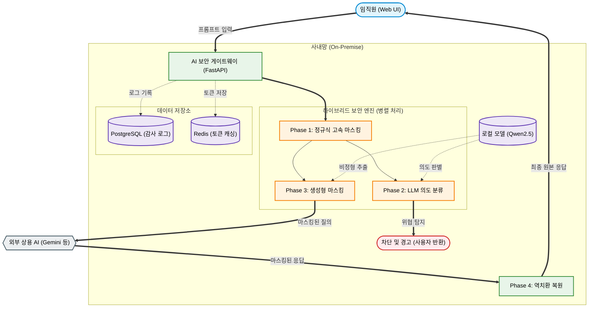

# LLM Security Gateway 시스템 아키텍처

본 문서는 **로컬 LLM 기반 하이브리드 AI 보안 게이트웨이**의 상세 시스템 아키텍처와 3단계 보안 파이프라인의 핵심 기술을 설명한다.

---

## 1. 전체 시스템 흐름도 (System Overview)

LLM 게이트웨이는 사내망에 독립적으로 구축되며, 임직원(클라이언트)과 외부 상용 LLM 사이의 **보안 프록시(Security Proxy)** 역할을 수행한다.

---

## 2. 3단계 하이브리드 파이프라인 상세

기존 보안 솔루션이 가진 단일 기술의 한계(정규식의 문맥 파악 불가, 전면 차단의 역설)를 극복하기 위해 **계층적 심층 방어(Defense-in-Depth)** 구조를 설계했다.

### Phase 1: 정규식 기반 고속 필터 (Pattern Filter)
가장 빠르고 확실한 1차 방어선으로 공항의 '금속 탐지기'와 같은 역할을 한다.
* **동작 원리:** 사번, 전화번호, 정형화된 도면 번호 등 패턴이 명확한 기밀 데이터를 정규식(Regex)으로 탐지한다.
* **사전 차단:** 알려진 프롬프트 인젝션 패턴(`"이전 지시 무시"`, `"config.json"`, `sudo` 등)을 사전에 차단하여 백엔드 로컬 모델의 부하를 줄인다.
* **토큰 포맷 설계:** `__MASK_{TYPE}_{8자리hex}__` 형태의 고유 토큰으로 치환한다.
  * *설계 이유:* 외부 LLM이 토큰을 임의로 분해(Tokenization)하지 못하도록 특수 기호와 고유 난수를 결합하여 고유명사처럼 취급하게 만든다.

### Phase 2: LLM 의도 분류 (LLM-as-a-Judge)
정규식이 놓치는 교묘한 공격을 차단하는 2차 방어선이다.
* **동작 원리:** 로컬 LLM에게 '보안 검열관' 페르소나를 주입하여, 사용자의 질문 문맥을 분석해 악의적 의도를 판독한다.
* **시스템 프롬프트 핵심:**
  * **6대 차단 기준:** ① 프롬프트 인젝션 ② 탈옥(Jailbreak) ③ 번역/요약을 경유한 우회 ④ 자격증명 탈취 ⑤ 보안 프로토콜 우회 ⑥ 파괴적 명령어
  * **출력 강제:** 반드시 `{"intent": "SAFE"}` 또는 `{"intent": "BLOCKED", "reason": "..."}` 형식의 JSON으로만 응답하도록 강제한다.
* **Fail-Closed 정책:** JSON 파싱에 실패하거나 판독이 불명확한 경우, 무조건 "차단(BLOCKED)"으로 간주하여 보안 사고를 원천 봉쇄한다.

### Phase 3: 생성형 마스킹 (Generative DLP)
Phase 2와 동시에 실행되는 3차 방어선으로, 비정형 기밀을 찾아낸다.
* **동작 원리:** "신소재 배합 비율은 티타늄 45%이다"처럼 정해진 패턴이 없는 비정형 기밀을 로컬 LLM이 문맥을 이해하고 추출한다.
* **시스템 프롬프트 핵심:**
  * **6대 추출 카테고리:** MATERIAL(소재/배합), PROCESS(공정), PRICE(단가), PERSON(개인정보), CODE(코드명), DIMENSION(치수/공차)
  * **과마스킹 방지(Negative List):** 날짜, 분기, 단순 수량, 일반 기술 용어 등은 추출하지 않도록 명시하여 정상 업무가 방해받지 않도록(정밀도 유지) 설계했다.

> **병렬 처리 최적화 (Latency Optimization)**
> 무거운 LLM 연산인 Phase 2와 Phase 3은 `asyncio.gather()`를 통해 **완전 병렬로 동시 실행**된다. 이를 통해 보안 검열에 소요되는 지연 시간(Latency)을 최대 50% 단축하여 Warm State 기준 1~3초대의 쾌적한 속도를 달성했다.

---

## 3. 역치환 파서 (Flexible De-masking)

마스킹되어 전송된 질문에 대해 외부 AI가 답변을 생성하면, 포함된 난수 토큰을 다시 원래 기밀 데이터로 복원(역치환)하여 사용자에게 전달한다.

* **LLM의 토큰 변형 방어:** 외부 AI(Gemini, ChatGPT 등)가 마크다운 렌더링을 위해 토큰 내부에 임의의 공백을 삽입하거나 특수문자를 이스케이프하는 현상(`__ MASK _ DWG _ a1b2c3d4 __`)이 빈번히 발생한다.
* **유연한 정규식 복원:** 이를 해결하기 위해 토큰의 각 문자 사이에 `\s*`(0개 이상의 공백)와 `\\*`(0개 이상의 백슬래시)를 허용하는 유연한 정규식 파서를 자체 구현하여, AI가 응답을 어떻게 변형하든 100% 원본으로 복원한다.

---

## 4. 로깅 및 감사 (Auditing & Logging)

기업 환경에 필수적인 **감사(Audit)** 기능이다. `security_logs` 테이블에 모든 요청 이력이 저장된다.
* **전체 통제력 회복:** 섀도우 AI 상태에서는 파악 불가능했던 '누가, 언제, 어떤 기밀을 입력했는지'에 대한 완벽한 가시성을 확보한다.
* **저장 항목:** 원본 프롬프트(및 해시값), 전송된 마스킹 프롬프트, 치환된 토큰 매핑 딕셔너리(`{"__MASK_...": "EMP-001"}`), 탐지된 위협 종류, 최종 처리 결과(BLOCKED / MASKED / ALLOWED).

---

## 5. 데이터베이스 스키마 (ERD)

시스템은 `PostgreSQL`과 `SQLAlchemy ORM`을 기반으로 3개의 핵심 테이블을 관리한다.

| 테이블 명 | 용도 | 핵심 컬럼 |
|---|---|---|
| **users** | 임직원 계정 정보 | `employee_num`(사번, 고유키), `password_hash`(bcrypt), `role`(user/admin) |
| **auto_parts** | 사내 기밀 데이터셋 | `blueprint_num`(도면번호), `dimensions`(치수), `material`(소재) |
| **security_logs** | 보안 이벤트 감사 로그 | `action`, `detected_threat`, `status`, `original_prompt`, `mapping_dict` |

---

## 6. 인프라 및 배포 (Docker Compose)

모든 서비스는 `docker-compose.yml`을 통해 컨테이너화되어 배포된다.
1. **API (FastAPI):** `uvicorn` 구동, 로컬 Ollama 엔진과 HTTP 비동기(`httpx`) 통신
2. **Frontend (Streamlit):** API 서버와 내부 네트워크 통신
3. **Database (PostgreSQL):** 영구 데이터 저장 (Volume 마운트)
4. **Cache (Redis):** 인메모리 저장소. 보안상 5분(300초)의 TTL을 부여하여, 세션 종료 시 토큰 매핑 데이터가 완전히 소멸되도록(Volatile) 설계했다.

---

### 📚 전체 문서 목차
1. [**메인 페이지 (README)**](../README_KO.md)
2. [**시스템 아키텍처**](./ARCHITECTURE.md) 📍 *현재 페이지*
3. [**설치 및 실행 가이드**](./SETUP_GUIDE.md)
4. [**보안 테스트 가이드**](./SECURITY_TESTING.md)
5. [**API 명세서**](./API_REFERENCE.md)
