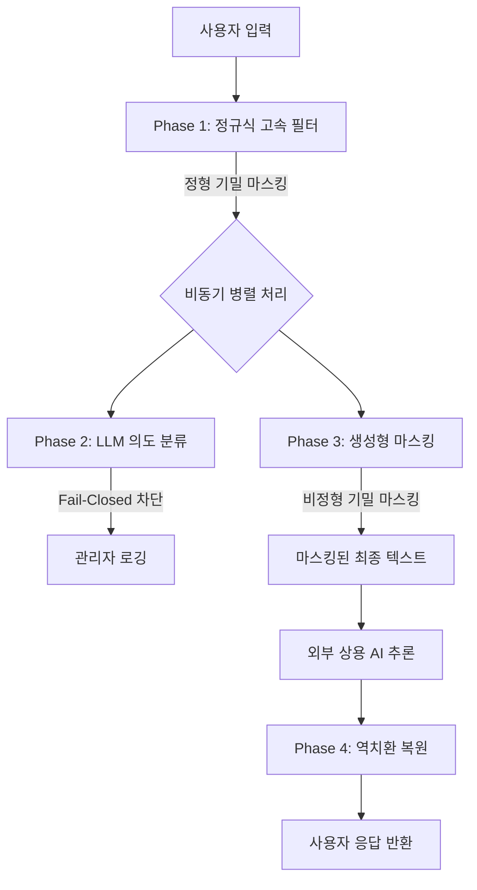

# LLM-based Hybrid AI Security Gateway

> **프롬프트 인젝션 방어와 기밀 데이터 비식별화를 위한 PoC(Proof of Concept)**


## 1. 연구 배경 및 문제 정의

생성형 AI의 기업 도입이 확산됨에 따라, 임직원의 **비의도적 기밀 유출**과 악의적인 **프롬프트 인젝션**이 핵심 보안 위협으로 대두되었다.

* **기밀 데이터 유출 심화:** Cyberhaven(2024) 보고서에 따르면 AI 도구에 입력된 데이터 중 27.4%가 기밀 정보이다.
* **기존 보안의 한계:** 기존 DLP(Data Loss Prevention) 솔루션은 정해진 패턴(주민번호 등)만 탐지할 뿐, 문맥 속에 숨겨진 비정형 기밀(예: 신소재 배합 비율)을 파악하지 못한다.
* **섀도우 AI (Shadow AI) 문제:** 보안을 이유로 사내망에서 AI 접근을 전면 차단하면, 임직원들이 개인 기기나 네트워크로 우회하여 접속하는 '섀도우 AI' 현상이 발생한다. 이는 회사의 통제 영역을 벗어나 유출 감사조차 불가능하게 만드는 역설적인 결과를 낳는다.

**핵심 연구 질문:**  
*"기밀은 보호하되, AI 사용은 안전하게 허용하는 중간 지점의 보안 아키텍처는 없는가?"*

---

## 2. 아키텍처 및 4대 설계 원칙

본 프로젝트는 기업(가상의 제조 기업 '오토코어') 사내망에 배치되어 외부 AI와 통신하는 **AI 보안 게이트웨이 프록시**를 제안하고 직접 구현했다.

### 설계 원칙
1. **완전한 로컬 처리**: 모든 보안 검열(마스킹, 의도 파악)은 사내 로컬 LLM에서 처리되어 데이터 주권을 보장한다.
2. **계층적 심층 방어 (Defense-in-Depth)**: 패턴 필터 → 의도 분류 → 생성형 마스킹의 3겹 방어망을 구축했다.
3. **동적 마스킹 및 역치환**: 차단이 아닌 '난수 치환'을 통해 안전한 데이터만 AI로 전송하고, 응답 시 원본으로 복원하여 사용자 경험을 보존한다.
4. **AI 고유 공격 대응**: LLM-as-a-Judge 기법을 적용하여 프롬프트 인젝션 등의 문맥적 위협을 판단한다.

---

## 3. 3단계 하이브리드 보안 파이프라인

게이트웨이의 핵심 엔진은 **정규식과 LLM을 결합한 하이브리드 아키텍처**이다. 



* **Phase 1 (정규식 고속 필터):** 사번, 도면 번호 등 정형화된 기밀 데이터를 초고속으로 `__MASK_TYPE_HEX__` 형태의 난수 토큰으로 치환한다.
* **Phase 2 (LLM-as-a-Judge):** 로컬 LLM(Qwen 2.5 7B)이 문맥을 분석하여 프롬프트 인젝션, 시스템 탈옥 시도를 탐지하고 즉시 차단(Fail-Closed)한다.
* **Phase 3 (Generative DLP):** 동일한 로컬 LLM이 문맥을 읽어 '공차', '배합비' 등 정규식이 잡지 못하는 비정형 기밀을 찾아내어 마스킹한다. (Phase 2와 `asyncio`로 병렬 처리하여 지연 시간 단축)

---

## 4. 핵심 기능 시연

### 1) 정상 질의 및 동적 마스킹 (UX 보존)
사용자가 기밀이 포함된 질문을 던지면, 기밀을 난수로 마스킹하여 외부 AI에 전달하고, 응답 시 완벽하게 역치환하여 반환한다.

> 
> *[UI] Streamlit 기반의 다크 테마 채팅 인터페이스*

### 2) 프롬프트 인젝션 방어
명령을 무시하거나 관리자 권한을 요구하는 문맥을 파악하여 차단한다.

> 
> *[방어] LLM-as-a-Judge에 의한 악의적 의도 차단 (붉은색 경고 배너)*

### 3) 관리자 보안 대시보드
게이트웨이를 통과하는 모든 이벤트(허용, 마스킹, 차단)와 원본/전송 프롬프트의 매핑 내역을 실시간으로 기록 및 조회한다.

> 
> *[로깅] 마스킹된 토큰과 치환된 원본 데이터를 대조할 수 있는 관리자 화면*

---

## 5. 시스템 성능 및 평가 (1,200건 벤치마크)

본 연구팀은 가혹 조건의 1,200건 자동화 테스트셋을 통해 성능을 입증했다.

| 평가 지표 | V1 (정규식 전용) | **V4 (하이브리드 제안 모델)** | 성과 |
|---|:---:|:---:|---|
| **종합 방어율 (Recall)** | 26.7% | **78.33%** | 약 2.9배 향상 |
| **인젝션 차단율** | ~15% | **91.67%** | 획기적 탐지율 확보 |
| **정밀도 (Precision)** | ~100% | **99.86%** | 정상 업무 방해 거의 없음 |
| **한국어 오탐률** | 0.0% | **0.0%** (0건/600건) | **업무 방해율 제로 달성** |
| **처리 지연 (Warm State)** | 0.1s | **1~3초대** | 비동기 설계로 오버헤드 최소화 |

**결론 및 의의:**  
소형 로컬 모델(7B)과 CPU 환경이라는 한계 속에서도 정밀도 99.86%를 달성하여 **아키텍처 자체의 견고함**을 증명했다. 향후 인프라 확장을 통해 70B 이상의 대형 모델을 적용하면 방어율(Recall)은 즉시 상승할 수 있는 확장성 높은 구조이다.

---

## 6. 기술 스택 (Tech Stack)

| 구분 | 사용 기술 |
|---|---|
| **Backend** | Python 3.11, FastAPI, Uvicorn |
| **Frontend** | Streamlit |
| **Database** | PostgreSQL 15, SQLAlchemy ORM |
| **Cache/KV** | Redis 7 |
| **AI / Security** | 로컬 Ollama (Qwen2.5:7b), Google Gemini API |
| **Infrastructure** | Docker, Docker Compose |

---

## 7. 빠른 시작 가이드 (Quick Start)

### 사전 요구사항
* Docker 및 Docker Compose
* 로컬에 [Ollama](https://ollama.com/) 설치 및 `qwen2.5:7b` 모델 풀링 (`ollama run qwen2.5:7b`)
* Google Gemini API Key

### 실행 방법

1. **저장소 클론 및 환경변수 설정**
   ```bash
   git clone https://github.com/your-repo/LLM_Gateway_Project.git
   cd LLM_Gateway_Project
   cp .env.example .env
   # .env 파일을 열고 GEMINI_API_KEY 등 환경변수 입력
   ```

2. **Docker Compose 실행**
   ```bash
   docker-compose up --build -d
   ```

3. **서비스 접속**
   * **프론트엔드 (UI)**: `http://localhost:8501`
   * **백엔드 (API Docs)**: `http://localhost:8000/docs`
   * **테스트 계정**: `EMP-001` / `pass1234` (사용자), `ADMIN-001` / `adminpass` (관리자)

---

## 8. 보안 테스트 실행 가이드
본 프로젝트는 `pytest` 기반의 자동화된 보안 테스트 스크립트를 제공한다. 테스트 코드 실행 및 벤치마크 결과 확인은 [보안 테스트 결과 보고서](Docs_Korean/SECURITY_TESTING.md)를 참고한다.

---

## 9. License

이 프로젝트는 [MIT License](LICENSE)에 따라 배포된다. 자유롭게 참고하고, 연구 및 학습 목적으로 활용할 수 있다.

---

## 주요 문서 바로가기

- [**AutoCore AI Security Gateway API 명세서 바로가기**](./Docs_Korean/API_REFERENCE.md)
- [**AutoCore AI Security Gateway 시스템 아키텍처 바로가기**](./Docs_Korean/ARCHITECTURE.md)
- [**AutoCore AI Security Gateway 보안 테스트 가이드 바로가기**](./Docs_Korean/SECURITY_TESTING.md)
- [**AutoCore AI Security Gateway 설치 및 실행 가이드 바로가기**](./Docs_Korean/SETUP_GUIDE.md)
